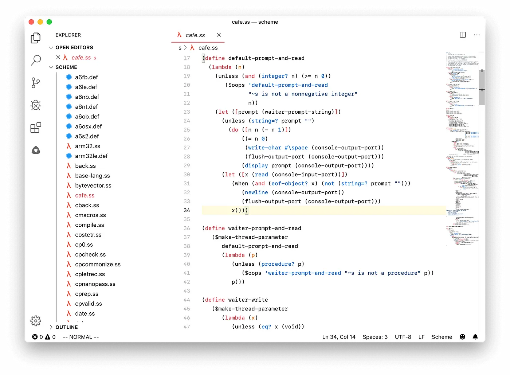

# The NoteWriter Desktop

## TODO: Backlog

* [x] Add fixtures to work in isolation when developing
* [ ] Add cmd+K using this [library](https://github.com/pacocoursey/cmdk)
* [ ] List all possible commandes: show daily quote, open file, open zen mode, ...

## Features

### Note: Cmd+K

Keep the UI minimal by forcing the user to use a menu to trigger most actions:

* Show daily quote
* Open a desk
* Open Zen Mode
* Open a file (= show all sorted notes present inside a file)
* Open Inspiration Mode
* List reminders
* Show priorities
* ...

## Inspiration

### Note: VS Code Light Them

> Keep the visual elements as minimal as possible (avoid splitters, separators, buttons, texts, etc.)

